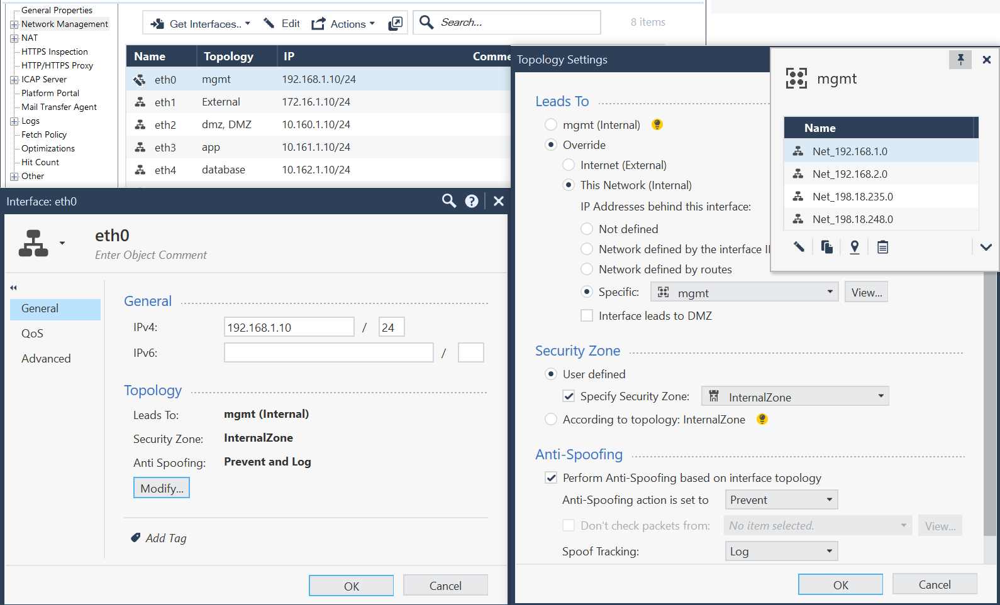
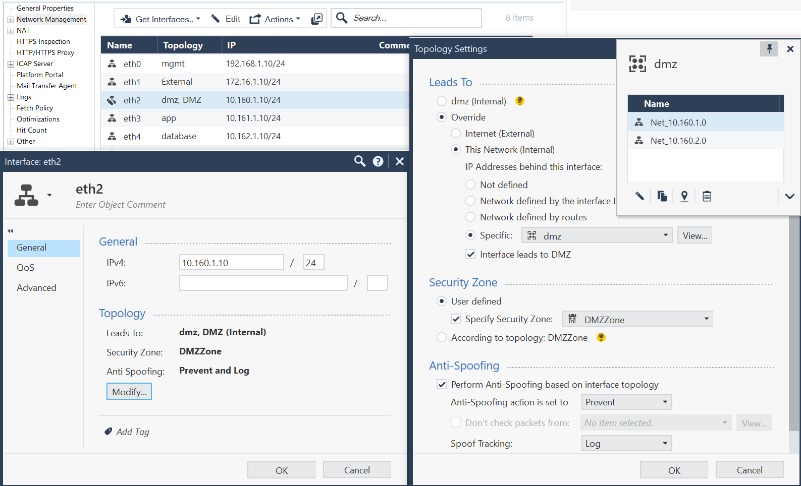
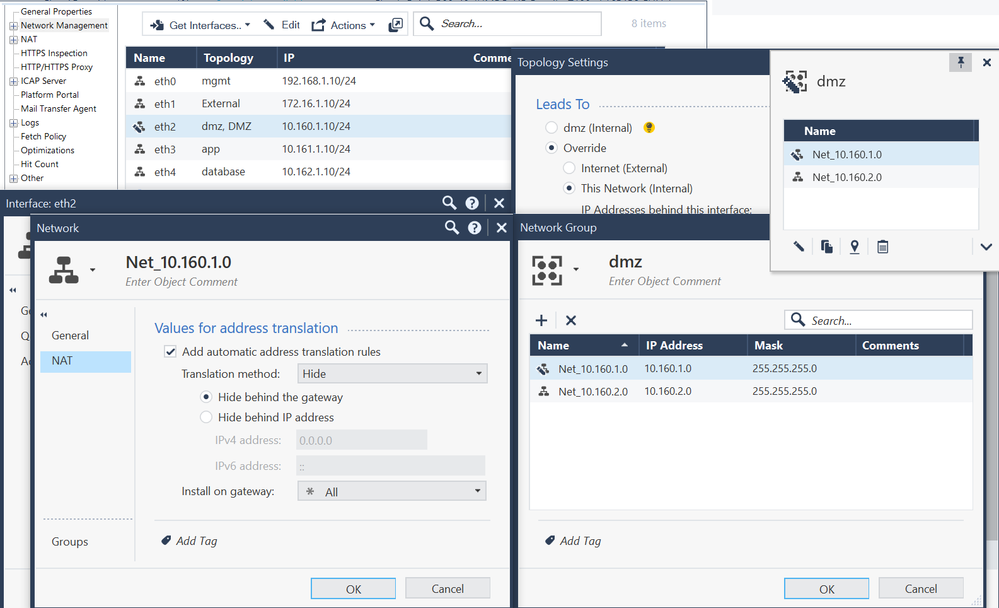
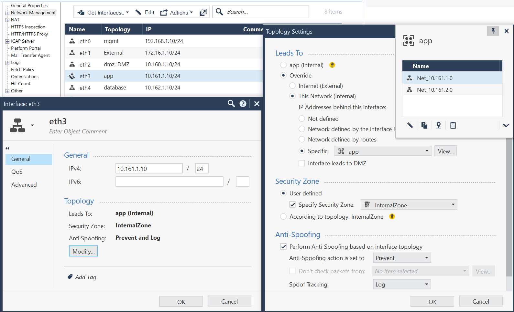
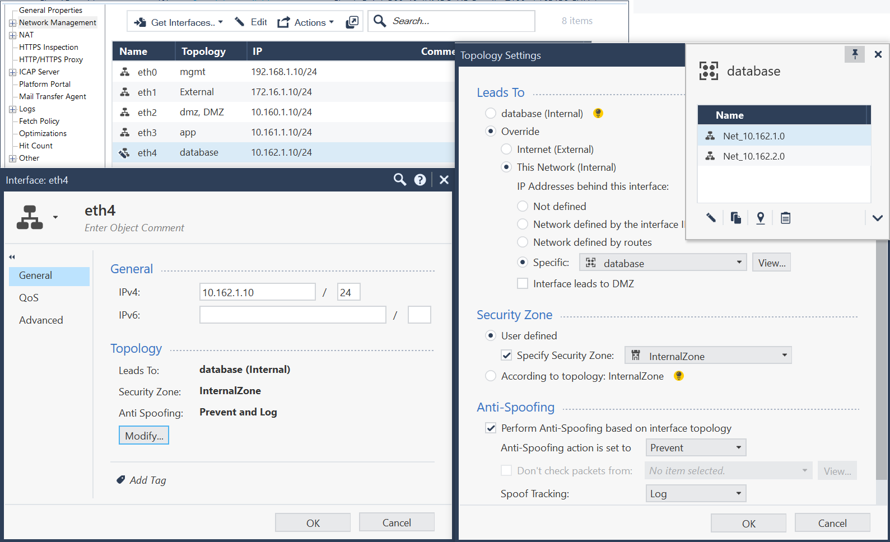
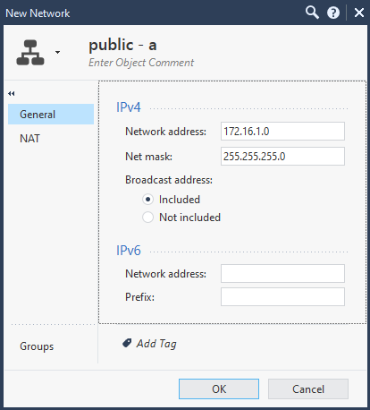
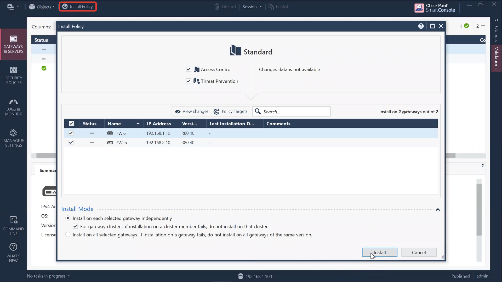

# Реализация защищенной высокодоступной сетевой инфраструктуры с выделением DMZ на основе Next-Generation Firewall

## Содержание
- [Описание решения](#описание-решения)
- [Архитектура решения и основные компоненты](#архитектура-решения-и-основные-компоненты)
- [Разворачиваемые сегменты и ресурсы](#разворачиваемые-сегменты-и-ресурсы)
- [Подготовка к развертыванию](#подготовка-к-развертыванию)
- [Развертывание Terraform сценария](#развертывание-terraform-сценария)
- [Действия после развертывания сценария с видео-демонстрацией](#действия-после-развертывания-сценария-с-видео-демонстрацией)
- [Подключение к сегменту управления](#подключение-к-сегменту-управления)
- [Настройка NGFW](#настройка-ngfw)
- [Включение работы модуля route-switcher](#включение-работы-модуля-route-switcher)
- [Проверка работоспособности](#проверка-работоспособности)
- [Проверка отказоустойчивости](#проверка-отказоустойчивости)
- [Требования к развертыванию в продуктивной среде](#требования-к-развертыванию-в-продуктивной-среде)
- [Удаление созданных ресурсов](#удаление-созданных-ресурсов)


## Описание решения

Сценарий разворачивает в Yandex Cloud облачную инфраструктуру для решения задач:
- защиты и сегментации инфраструктуры на зоны безопасности
- публикации приложений в интернет из зоны [DMZ](https://ru.wikipedia.org/wiki/DMZ_(компьютерные_сети))
- обеспечения высокой доступности развернутых приложений

Каждый сегмент сети (далее сегмент) содержит ресурсы одного назначения, обособленные от других ресурсов. Например, DMZ сегмент предназначен для размещения общедоступных приложений (обычно Frontend веб-сервера), а сегмент Application содержит Backend приложения. В облаке каждому сегменту соответствует свой каталог и своя облачная сеть VPC. Связь между сегментами происходит через виртуальные машины Next-Generation Firewall (NGFW), обеспечивающие комплексную защиту сегментов и контроль трафика между сегментами. 

Высокая доступность архитектуры достигается за счет:
- использования двух NGFW
- размещения ресурсов в двух зонах доступности
- сервиса [Application Load Balancer](#application-load-balancer-alb) для отказоустойчивости и балансировки опубликованных приложений в DMZ
- [Облачной функции](#terraform-модуль-route-switcher) для переключения исходящего из сегмента трафика при отказе NGFW

Посмотреть вебинар Yandex Cloud "Реализуем защищённую высокодоступную сетевую инфраструктуру" (в вебинаре используется предыдущая версия модуля route-switcher):

[](https://www.youtube.com/live/brX-lIo6cLg?feature=share)


## Архитектура решения и основные компоненты


Описание элементов схемы:

| Название элемента | Описание | Комментарии |
| ----------- | ----------- | ----------- | 
| VPC: public | Сегмент сети public | Для организации публичного доступа из интернет | 
| VPC: mgmt | Сегмент сети mgmt | Для управления облачной инфраструктурой и размещения служебных ресурсов | 
| VPC: dmz | Сегмент сети DMZ | Для размещения Frontend приложений, доступных из интернет | 
| VPC: app | Сегмент сети app | Для размещения Backend приложений | 
| VPC: database | Сегмент сети database | Для размещения баз данных |
| FW-A | Виртуальная машина Check Point NGFW | Для защиты инфраструктуры и сегментации сети на зоны безопасности. Активен для входящего трафика и исходящего трафика. |
| FW-B | Виртуальная машина Check Point NGFW | Для защиты инфраструктуры и сегментации сети на зоны безопасности. Активен для входящего трафика и в резерве для исходящего трафика. |
| ALB | Балансировщик нагрузки на FW-A и FW-B | Для балансировки и отказоустойчивости опубликованных в DMZ приложений |
| Функция route-switcher | Облачная функция | Для переключения таблицы маршрутизации в сегменте | 
| Jump ВМ | Виртуальная машина c настроенным [WireGuard VPN](https://www.wireguard.com/) | Для защищенного VPN подключения к сегменту управления |
| Сервер управления FW | Виртуальная машина c ПО Check Point Security Management | Для централизованного управления решением Check Point NGFW |
| NLB | Сетевой балансировщик на группу веб-серверов | Для балансировки трафика на веб-серверы тестового приложения в DMZ сегменте |
| Приложение | ВМ с веб-сервером Nginx | Пример тестового приложения, развернутого в DMZ сегменте |

</details>

Ключевыми элементами решения являются: 
- [Next-Generation Firewall](#next-generation-firewall)
- [Application Load Balancer](#application-load-balancer-alb)
- [Terraform модуль route-switcher](#terraform-модуль-route-switcher)
- [Группы безопасности](#группы-безопасности)

FW-A и FW-B работают в режиме Active/Active для входящего в DMZ трафика и в режиме Active/Standby для исходящего трафика из сегментов.


В случае отказа FW-A сетевая связанность с интернетом и между сегментами будет выполняться через FW-B


### Next-Generation Firewall

NGFW используется для защиты и сегментации облачной сети с выделением DMZ зоны для размещения публичных приложений.
В [Yandex Cloud Marketplace](https://cloud.yandex.ru/marketplace?categories=security) доступно несколько вариантов NGFW.

В данном сценарии развернуто решение [Check Point CloudGuard IaaS](https://cloud.yandex.ru/marketplace/products/checkpoint/cloudguard-iaas-firewall-tp-payg-m):
- Межсетевой экран, NAT, предотвращение вторжений, антивирус и защита от ботов
- Гранулярный контроль трафик на уровне приложений, логирование сессий
- Централизованное управление с помощью решения Check Point Security Management
- Решение Check Point в данном примере настроено с базовыми политиками доступа (Access Control) и NAT

Решение Check Point CloudGuard IaaS доступно в Yandex Cloud Marketplace в вариантах Pay as you go и BYOL. В этом примере используется BYOL вариант с Trial периодом 15 дней:
- 2 ВМ NGFW [Check Point CloudGuard IaaS - Firewall & Threat Prevention BYOL](https://cloud.yandex.ru/marketplace/products/checkpoint/cloudguard-iaas-firewall-tp-byol-m)
- ВМ сервера управления [Check Point CloudGuard IaaS - Security Management BYOL](https://cloud.yandex.ru/marketplace/products/checkpoint/cloudguard-iaas-security-management-byol-m)

Для использования в продуктивной среде рекомендуется рассматривать варианты:
- NGFW [Check Point CloudGuard IaaS - Firewall & Threat Prevention PAYG](https://cloud.yandex.ru/marketplace/products/checkpoint/cloudguard-iaas-firewall-tp-payg-m)
- Для сервера управления Check Point CloudGuard IaaS - Security Management необходимо приобрести отдельную лицензию либо использовать свою on-prem инсталляцию сервера управления

Ссылки на вебинары по использованию решений Check Point в Yandex Cloud
- [Check Point в Yandex Cloud Marketplace](https://youtu.be/qvR9G_oDfnE)
- [Обзор и установка CloudGuard IaaS Gateway в Yandex Cloud](https://youtu.be/LtQltM71cUw)
- [Установка CloudGuard IaaS Security Management и Standalone в Yandex Cloud](https://youtu.be/MraLOJRDWts)

### Application Load Balancer (ALB)


Для балансировки трафика приложений и отказоустойчивости в работе приложений, опубликованных в DMZ, используется [ALB](https://cloud.yandex.ru/docs/application-load-balancer/concepts/), который балансирует запросы пользователей на public интерфейсы FW-A и FW-B. Таким образом обеспечивается работа FW-A и FW-B в режиме Active/Active для входящего трафика в DMZ.
В примере используется группа бэкендов Stream (TCP) с [привязкой пользовательской сессии](https://cloud.yandex.ru/docs/application-load-balancer/concepts/backend-group#session-affinity) к эндпойнту (FW) на основе IP адреса пользователя.
По умолчанию балансировщик ALB равномерно распределяет трафик между FW-A и FW-B. Можно настроить [локализацию трафика](https://cloud.yandex.ru/docs/application-load-balancer/concepts/backend-group#locality), чтобы ALB отправлял запросы к FW той зоны доступности, в которой балансировщик принял запрос. Если в этой зоне доступности нет работающего FW, балансировщик отправит запрос в другую зону.


> **Важная информация**
>  
> На FW-A и FW-B необходимо настроить Source NAT на IP адрес FW в сегменте dmz для обеспечения прохождения ответа от приложения через тот же FW, через который поступил запрос от пользователя. Смотрите раздел [Настройка NGFW](#настройка-ngfw) пункт 11.

Application Load Balancer предоставляет расширенные возможности, среди которых:
- Поддержка протоколов: HTTP/S, HTTP/S WebSocket, TCP/TLS, HTTP/S gRPC 
- Гибкое распределение трафика между бэкендами приложений
- Обработка TLS-трафика: установка соединения и терминация TLS-сессий с помощью сертификатов из Yandex Сertificate Manager
- Возможность привязки пользовательской сессии и выбор режимов балансировки
- Создание и модификация ответов на запросы
- Анализ логов


### Terraform модуль route-switcher

В облачной сети Yandex Cloud не поддерживается работа протоколов VRRP/HSRP между FW. 

Для обеспечения отказоустойчивости исходящего трафика из сегмента используется [решение yc-route-switcher](https://github.com/yandex-cloud-examples/yc-route-switcher/), которое выполняет следующие действия:
- Переключение next hop адресов в таблицах маршрутизации при отказе FW-A на FW-B
- Возврат next hop адресов в таблицах маршрутизации на FW-A после его восстановления

В данном сценарии подсети используют таблицу маршрутизации через FW-A для исходящего из сегмента трафика.

Среднее время реакции на сбой составляет 1 мин. Возможно уменьшить интервал между последовательными проверками состояния сетевых ВМ во время работы облачной функции с помощью задания параметра `router_healthcheck_interval` во [входных параметрах](https://github.com/yandex-cloud-examples/yc-route-switcher/?tab=readme-ov-file#входные-параметры-модуля) модуля route-switcher. По умолчанию это значение 60 с. Если меняется значение по умолчанию, то рекомендуется дополнительно провести тестирование сценариев отказоустойчивости. Не рекомендуется устанавливать значение интервала менее 10 с.


Модуль route-switcher создает следующие ресурсы, необходимые для его работы:
- Облачную функцию route-switcher
- NLB 
- Бакет в Object Storage 

Описание элементов схемы:

| Название элемента | Описание |
| ----------- | ----------- |
| Каталог: mgmt | Каталог для размещения компонент модуля route-switcher |
| VPC: mgmt | В подсетях сегмента управления расположены сетевые интерфейсы FW-A и FW-B, используемые для проверки их доступности |
| FW-A, FW-B | Виртуальные машины Check Point NGFW, для которых требуется обеспечить отказоустойчивость |
| Функция route-switcher | Облачная функция, которая выполняет проверку состояния FW-A и FW-B и в случае недоступности FW-A переключает next hop адреса в таблицах маршрутизации на FW-B. Также функция возвращает next hop адреса в таблицах маршрутизации на FW-A после его восстановления. | 
| NLB | Сетевой балансировщик для мониторинга доступности FW-A и FW-B |
| Object Storage | Бакет в Object Storage для хранения файла конфигурации с информацией:<br>- таблицы маршрутизации с указанием предпочтительных next hop адресов для префиксов<br>- IP-адреса FW-A и FW-B: для проверки доступности, адреса для каждого сетевого интерфейса FW (IP-адрес FW и соответствующий IP-адрес резервного FW) |


### Алгоритм работы функции route-switcher

<details>
<summary>Посмотреть подробности</summary>

Функция route-switcher вызывается по триггеру раз в минуту (значение по умолчанию), проверяет в каком состоянии находятся сетевые ВМ, и в случае недоступности сетевых ВМ переключает next hop адреса в таблицах маршрутизации. При восстановлении сетевой ВМ функция route-switcher возвращает ее next hop адреса в таблицах маршрутизации (если настроена такая опция).

Возможно уменьшить интервал между последовательными проверками состояния сетевых ВМ во время работы облачной функции с помощью задания параметра `router_healthcheck_interval` во входных параметрах модуля. По умолчанию это значение 60 с. Если меняется значение по умолчанию, то рекомендуется дополнительно провести тестирование сценариев отказоустойчивости. Не рекомендуется устанавливать значение интервала менее 10 с.


</details>


### Группы безопасности

Группы безопасности используются для контроля трафика между ресурсами внутри сегмента.

В данном сценарии группы безопасности разрешают входящий трафик по портам TCP 443, 22 и ICMP пакеты от источников внутри группы, а также разрешают любой исходящий трафик. Группы безопасности в сегментах mgmt, dmz, public также имеют дополнительные разрешения, например, для работы балансировщиков, NGFW и других развернутых ресурсов.

## Разворачиваемые сегменты и ресурсы

Решение создает в облаке ресурсы для 7 сегментов 

<details>
<summary>Посмотреть подробности</summary>

| Сегмент | Описание | Ресурсы | Каталоги и сети | Группы безопасности | 
| ----------- | ----------- | ----------- | ----------- | ----------- |
| public | публичный доступ из интернет | ALB | + | + |
| mgmt | управление облачной инфраструктурой | 2 x Check Point NGFW, сервер управления Check Point, Jump ВМ с WireGuard для подключения из интернет, облачная функция route-switcher, NLB для проверки доступности NGFW, бакет для хранения файлов конфигураций для функции route-switcher | + | + |
| dmz | для размещения Frontend приложений, доступных из интернет | NLB для балансировки по веб-серверам, группа виртуальных машин с 2-мя веб-серверами Nginx для примера | + | + |
| app | для размещения Backend приложений | | + | + |
| database | для размещения баз данных | | + | + |
| vpc6 | на будущее | | + | + |
| vpc7 | на будущее | | + | + |

</details>


## Подготовка к развертыванию

1. Перед выполнением развертывания нужно [зарегистрироваться в Yandex Cloud и создать платежный аккаунт](https://cloud.yandex.ru/docs/tutorials/infrastructure-management/terraform-quickstart#before-you-begin)

2. [Установите Terraform](https://cloud.yandex.ru/docs/tutorials/infrastructure-management/terraform-quickstart#install-terraform)

3. Проверьте наличие учетной записи в облаке с правами admin на облако

4. [Установите и настройте Yandex Cloud CLI](https://cloud.yandex.ru/docs/cli/quickstart)

5. [Установите Git](https://github.com/git-guides/install-git)

6. Проверьте квоты в облаке, чтобы была возможность развернуть ресурсы в сценарии:

    <details>
    <summary>Посмотреть справочную информацию по количеству ресурсов, создаваемых в сценарии</summary>

    | Ресурс | Количество |
    | ----------- | ----------- |
    | Каталоги | 7 |
    | Группы виртуальных машин | 1 |
    | Виртуальные машины | 6 |
    | vCPU виртуальных машин | 18 |
    | RAM виртуальных машин | 30 ГБ |
    | Диски | 6 |
    | Объем SSD дисков | 360 ГБ |
    | Объем HDD дисков | 30 ГБ |
    | Облачные сети | 7 |
    | Подсети | 14 |
    | Таблицы маршрутизации | 4 |
    | Группы безопасности | 10 |
    | Статические публичные IP-адреса | 2 |
    | Публичные IP-адреса | 2 |
    | Статические маршруты | 17 |
    | Бакеты | 1 |
    | Cloud функции | 1 |
    | Триггеры для cloud функций | 1 |
    | Общий объём RAM всех запущенных функций | 128 МБ |
    | Балансировщики NLB | 2 |
    | Целевые группы для NLB | 2 |
    | Балансировщики ALB | 1 |
    | Группы бэкендов для ALB | 1 |
    | Целевые группы для ALB | 1 |

    </details>


## Развертывание Terraform сценария

1. Склонируйте репозиторий `yandex-cloud-examples/yc-dmz-with-high-available-ngfw` из GitHub и перейдите в папку сценария `yc-dmz-with-high-available-ngfw`:
    ```bash
    git clone https://github.com/yandex-cloud-examples/yc-dmz-with-high-available-ngfw.git
    cd yc-dmz-with-high-available-ngfw
    ```

2. Настройте окружение для развертывания ([подробности](https://cloud.yandex.ru/docs/tutorials/infrastructure-management/terraform-quickstart#get-credentials)):
    ```bash
    export YC_TOKEN=$(yc iam create-token)
    ```

3. Заполните файл `terraform.tfvars` вашими значениями переменных. Файл содержит примеры значений, но вы можете заменить их своими данными (идентификатор облака, название vpc, подсети, порт приложения в DMZ, параметры для подключения к Jump ВМ). Обязательно укажите идентификатор вашего облака `cloud_id` и список публичных IP адресов/подсетей `trusted_ip_for_access_jump-vm`, с которых разрешено подключение к Jump ВМ. 

    <details>
    <summary>Посмотреть переменные в terraform.tfvars</summary>

    | Название | Описание | Пример значения |
    | ----------- | ----------- | ----------- |
    | cloud_id | Идентификатор вашего облака в Yandex Cloud | b1g8dn6s3v2eiid9dbci |
    | public_app_port | TCP порт для опубликованного в DMZ приложения, на котором балансировщик ALB будет принимать входящий трафик от пользователей | "80" |
    | internal_app_port | Внутренний TCP порт опубликованного в DMZ приложения, на который балансировщик ALB будет направлять трафик. Может отличаться от public_app_port или совпадать с ним. | "8080" |
    | trusted_ip_for_access_jump-vm | Список публичных IP адресов/подсетей, с которых разрешено подключение к Jump ВМ. Используется во входящем правиле группы безопасности для Jump ВМ.  | ["A.A.A.A/32", "B.B.B.0/24"] |
    | wg_port | UDP порт для входящих соединений в настройках WireGuard на Jump ВМ | "51820" |
    | wg_client_dns | Список адресов DNS серверов в облачной сети управления, которые будет использовать рабочая станция администратора после поднятия туннеля WireGuard к Jump ВМ | "192.168.1.2, 192.168.2.2" |
    | jump_vm_admin_username | Имя пользователя для подключения к Jump ВМ | "admin" |
    | **Сегмент 1** |
    | vpc_name_1 | Название VPC и каталога для 1-го сегмента | "demo-dmz" |
    | subnet-a_vpc_1 | Подсеть в зоне A для 1-го сегмента | "10.160.1.0/24" | 
    | subnet-b_vpc_1 | Подсеть в зоне B для 1-го сегмента | "10.160.2.0/24" | 
    | **Сегмент 2** |||
    | vpc_name_2 | Название VPC и каталога для 2-го сегмента | "demo-app" |
    | subnet-a_vpc_2 | Подсеть в зоне A для 2-го сегмента | "10.161.1.0/24" | 
    | subnet-b_vpc_2 | Подсеть в зоне B для 2-го сегмента | "10.161.2.0/24" | 
    | **Сегмент 3** |||
    | vpc_name_3 | Название VPC и каталога для 3-го сегмента | "demo-public" |
    | subnet-a_vpc_3 | Подсеть в зоне A для 3-го сегмента | "172.16.1.0/24" | 
    | subnet-b_vpc_3 | Подсеть в зоне B для 3-го сегмента | "172.16.2.0/24" | 
    | **Сегмент 4** |||
    | vpc_name_4 | Название VPC и каталога для 4-го сегмента | "demo-mgmt" |
    | subnet-a_vpc_4 | Подсеть в зоне A для 4-го сегмента | "192.168.1.0/24" | 
    | subnet-b_vpc_4 | Подсеть в зоне B для 4-го сегмента | "192.168.2.0/24" | 
    | **Сегмент 5** |||
    | vpc_name_5 | Название VPC и каталога для 5-го сегмента | "demo-database" |
    | subnet-a_vpc_5 | Подсеть в зоне A для 5-го сегмента | "10.162.1.0/24" | 
    | subnet-b_vpc_5 | Подсеть в зоне B для 5-го сегмента | "10.162.2.0/24" | 
    | **Сегмент 6** |||
    | vpc_name_6 | Название VPC и каталога для 6-го сегмента | "demo-vpc6" |
    | subnet-a_vpc_6 | Подсеть в зоне A для 6-го сегмента | "10.163.1.0/24" | 
    | subnet-b_vpc_6 | Подсеть в зоне B для 6-го сегмента | "10.163.2.0/24" | 
    | **Сегмент 7** |||
    | vpc_name_7 | Название VPC и каталога для 7-го сегмента | "demo-vpc7" |
    | subnet-a_vpc_7 | Подсеть в зоне A для 7-го сегмента | "10.164.1.0/24" | 
    | subnet-b_vpc_7 | Подсеть в зоне B для 7-го сегмента | "10.164.2.0/24" | 

    </details>

4. Выполните инициализацию Terraform:
    ```bash
    terraform init
    ```

5. Проверьте конфигурацию Terraform файлов:
    ```bash
    terraform validate
    ```

6. Проверьте список создаваемых облачных ресурсов:
    ```bash
    terraform plan
    ```

7. Создайте ресурсы. На развертывание всех ресурсов в облаке потребуется около 7 мин:
    ```bash
    terraform apply
    ```

8. После завершения процесса terraform apply в командной строке будет выведен список информации о развернутых ресурсах. В дальнейшем его можно будет посмотреть с помощью команды `terraform output`:

    <details>
    <summary>Посмотреть информацию о развернутых ресурсах</summary>

    | Название | Описание | Пример значения |
    | ----------- | ----------- | ----------- |
    | dmz-web-server-nlb_ip_address | IP адрес балансировщика трафика в сегменте dmz, за которым находится целевая группа с веб-серверами для тестирования публикации приложения из dmz. Используется для настройки Destination NAT в FW. | "10.160.1.100" |
    | fw-a_ip_address | IP адрес в сети управления для FW-A | "192.168.1.10" |
    | fw-alb_public_ip_address | Публичный IP адрес балансировщика ALB. Используется для обращения к опубликованному в DMZ приложению из интернет. | "C.C.C.C" |
    | fw-b_ip_address | IP адрес в сети управления для FW-B | "192.168.2.10" |
    | fw_gaia_portal_mgmt-server_password | Пароль по умолчанию для первоначального подключения по https к IP адресу сервера управления FW | "admin" |
    | fw_mgmt-server_ip_address | IP адрес в сети управления для сервера управления FW | "192.168.1.100" |
    | fw_sic-password | Однократный пароль (SIC) для добавления FW в сервер управления FW | Не показывается в общем выводе `terraform output`. Для отображения значения используйте `terraform output fw_sic-password` |
    | fw_smartconsole_mgmt-server_password | Пароль для подключения к серверу управления FW с помощью графического приложения Check Point SmartConsole | Не показывается в общем выводе `terraform output`. Для отображения значения используйте `terraform output fw_smartconsole_mgmt-server_password` |
    | jump-vm_path_for_WireGuard_client_config | Файл конфигурации для защищенного VPN подключения с помощью клиента WireGuard к Jump ВМ | "./jump-vm-wg.conf" |
    | jump-vm_public_ip_address_jump-vm | Публичный IP адрес Jump ВМ | "D.D.D.D" |
    | path_for_private_ssh_key | Файл с private ключом для подключения по протоколу SSH к ВМ (jump-vm, fw-a, fw-b, mgmt-server, веб-серверы в сегменте dmz) | "./pt_key.pem" |
    | route-switcher_nlb | Имя сетевого балансировщика в каталоге `mgmt` для мониторинга доступности FW-A и FW-B | "route-switcher-hnaf1gr0sx" |
    | route-switcher_bucket | Имя бакета в Object Storage в каталоге `mgmt` для хранения файла конфигурации с информацией:<br>- таблицы маршрутизации с указанием предпочтительных next hop адресов для префиксов<br>- IP-адреса FW-A и FW-B: для проверки доступности, адреса для каждого FW (IP-адрес FW и соответствующий IP-адрес резервного FW) | "route-switcher-hnaf1gr0sx" |
    | route-switcher_function | Имя облачной функции в каталоге `mgmt`, обеспечивающей работу модуля route-switcher по отказоустойчивости исходящего трафика из сегментов | "route-switcher-lb-hnaf1gr0sx" |

    </details>

## Действия после развертывания сценария с видео-демонстрацией

После успешного развертывания сценария Terraform рекомендуется выполнить следующую последовательность действий:
1. Ознакомиться с [требованиями к развертыванию в продуктивной среде](#требования-к-развертыванию-в-продуктивной-среде)
2. [Подключиться к сегменту управления](#подключение-к-сегменту-управления) с помощью Jump ВМ для настройки решения Check Point NGFW и доступа по SSH к развернутым ресурсам в облаке
3. [Настроить NGFW](#настройка-ngfw) под задачи вашей инфраструктуры или согласно приведенным шагам в качестве примера 
4. [Включить работу](#включение-работы-модуля-route-switcher) модуля route-switcher
5. Выполнить базовую [проверку работоспособности](#проверка-работоспособности) решения 
6. Выполнить базовую [проверку отказоустойчивости](#проверка-отказоустойчивости) решения 

> **Важная информация**
> 
> Без шагов настройки NGFW и включения работы модуля route-switcher проверить работоспособность и отказоустойчивость решения не получится.

Посмотреть [**видео-демонстрацию**](https://storage.yandexcloud.net/cloud-www-assets/architects-video/architect-solutions-library.mp4), которая содержит:
- Демонстрацию основных элементов решения в консоли Yandex Cloud после развертывания Terraform
- Подключение к сегменту управления и первоначальную настройка NGFW
- Пример базовых политик доступа и NAT в NGFW 
- Проверка действия политик доступа на NGFW
- Тестирование отказоустойчивости

## Подключение к сегменту управления

После выполнения развертывания в mgmt сегменте сети управления появляется Jump ВМ на основе образа Ubuntu с настроенным [WireGuard VPN](https://www.wireguard.com/) для защищенного подключения. После установления VPN туннеля к Jump ВМ на рабочей станции администратора появятся маршруты через VPN туннель к подсетям сегментов mgmt, dmz, app, database.  
Вы также можете подключиться к Jump ВМ по SSH, используя SSH ключ и логин из вывода `terraform output` и логин из значения переменной `jump_vm_admin_username`.

1. Установите на рабочую станцию администратора [приложение WireGuard](https://www.wireguard.com/install/) для вашей операционной системы.

2. В папке с Terraform сценарием после создания ресурсов появляется файл `jump-vm-wg.conf` с настройками клиента WireGuard для подключения к Jump ВМ. Добавьте новый туннель (Import tunnel(s) from file) в приложении WireGuard для Windows или Mac OS, используя файл `jump-vm-wg.conf`. Активируйте туннель нажатием на кнопку Activate.  

3. Проверьте в командной строке с помощью `ping 192.168.1.100` сетевую связность с сервером управления FW через VPN туннель WireGuard. 

Смотрите пример подключения к сегменту управления в [**видео-демонстрации**](https://storage.yandexcloud.net/cloud-www-assets/architects-video/architect-solutions-library.mp4).

## Настройка NGFW

Вы можете настроить развернутые FW-A и FW-B под ваши задачи в соответствии с корпоративной политикой безопасности. Для управления и настройки решения Check Point используется графическое приложение SmartConsole, доступное для операционной системы Windows. 

В качестве примера приводятся шаги настройки FW-A и FW-B с базовыми политиками доступа (Access Control) и NAT, необходимыми для проверки работоспособности и тестирования отказоустойчивости в сценарии, но не являющимися достаточными для развертывания инфраструктуры в продуктивной среде.

Шаги настройки NGFW в этом сценарии состоят из следующей последовательности действий, выполняемых в SmartConsole:
- Добавление FW-A и FW-B
- Настройка сетевых интерфейсов FW-A и FW-B
- Создание сетевых объектов 
- Настройка политик доступа (Access Control - Policy)
- Настройка политик NAT трансляций (Access Control - NAT)

Смотрите пример настройки NGFW в [**видео-демонстрации**](https://storage.yandexcloud.net/cloud-www-assets/architects-video/architect-solutions-library.mp4).

1. Подключитесь к серверу управления FW по https://192.168.1.100. Учетная запись администратора: логин `admin`, пароль `admin`. Откроется Gaia Portal. После подключения замените пароль, выбрав `User Management > Change My Password`.

2. На главной странице Gaia Portal скачайте графическое приложение SmartConsole по ссылке в верху страницы: `Manage Software Blades using SmartConsole. Download Now!` Приложение SmartConsole требует операционной системы Windows. Установите SmartConsole на рабочую станцию администратора.

3. Зайдите в SmartConsole, укажите для подключения логин `admin`, IP адрес сервера управления `192.168.1.100` и пароль из вывода команды `terraform output fw_smartconsole_mgmt-server_password`.

4. Добавьте FW-A и FW-B в сервер управления (действие New Gateway), используя Wizard:
    - название FW: FW-a и FW-b
    - тип Gateway: CloudGuard IaaS 
    - Gateway IP: IP адрес FW в mgmt сегменте (`192.168.1.10` для FW-A и `192.168.2.10` для FW-B)
    - Initiated trusted communication now: One-time SIC пароль из вывода команды `terraform output fw_sic-password`

5. Настройте сетевые интерфейсы для каждого FW (`Network Management > Topology Settings`):
    - Переименуйте Network Groups, созданные по умолчанию на основе статических маршрутов в FW (например, переименуйте FW-a_eth0 в mgmt)
    - Укажите Security Zone
    - Проверьте, что Anti Spoofing включен (Prevent and Log)
    - Настройте для dmz сетей (Net_10.160.1.0 и Net_10.160.2.0) Automatic Hide NAT трансляции, чтобы выполнялся Source NAT на public интерфейс FW для трафика, инициируемого в dmz сегменте в интернет 

    <details>
    <summary>Настройка интерфейсов для FW-A</summary>

    | Interface | IPv4 address/mask | Leads To | Security Zone | Anti Spoofing |
    | ----------- | ----------- | ----------- | ----------- | ----------- |
    | eth0 | 192.168.1.10/24 | FW-a_eth0 -> mgmt (Internal) | InternalZone | Prevent and Log |
    | eth1 | 172.16.1.10/24 | Internet (External) | ExternalZone | Prevent and Log |
    | eth2 | 10.160.1.10/24 | FW-a_eth2 -> dmz, DMZ (Internal) | DMZZone | Prevent and Log |
    | eth3 | 10.161.1.10/24 | FW-a_eth3 -> app (Internal) | InternalZone | Prevent and Log |
    | eth4 | 10.162.1.10/24 | FW-a_eth4 -> database (Internal) | InternalZone | Prevent and Log |
    | eth5 | 10.163.1.10/24 | This Network (Internal) | InternalZone | Prevent and Log |
    | eth6 | 10.164.1.10/24 | This Network (Internal) | InternalZone | Prevent and Log |

        

    <details>
    <summary>Настройка mgmt интерфейса FW-A</summary>

    

    </details>
    
    <details>
    <summary>Настройка public интерфейса FW-A</summary>

    

    </details>

    <details>
    <summary>Настройка dmz интерфейса FW-A</summary>

    

    </details>

    <details>
    <summary>Настройка NAT для dmz подсети зоны A</summary>

    

    </details>

    <details>
    <summary>Настройка NAT для dmz подсети зоны B</summary>

    

    </details>

    <details>
    <summary>Настройка app интерфейса FW-A</summary>

    

    </details>

    <details>
    <summary>Настройка database интерфейса FW-A</summary>

    

    </details>

    </details>

    <details>
    <summary>Настройка интерфейсов для FW-B</summary>

    | Interface | IPv4 address/mask | Leads To | Security Zone | Anti Spoofing |
    | ----------- | ----------- | ----------- | ----------- | ----------- |
    | eth0 | 192.168.2.10/24 | FW-b_eth0 -> mgmt (Internal) | InternalZone | Prevent and Log |
    | eth1 | 172.16.2.10/24 | Internet (External) | ExternalZone | Prevent and Log |
    | eth2 | 10.160.2.10/24 | FW-b_eth2 -> dmz, DMZ (Internal) | DMZZone | Prevent and Log |
    | eth3 | 10.161.2.10/24 | FW-b_eth3 -> app (Internal) | InternalZone | Prevent and Log |
    | eth4 | 10.162.2.10/24 | FW-b_eth4 -> database (Internal) | InternalZone | Prevent and Log |
    | eth5 | 10.163.2.10/24 | This Network (Internal) | InternalZone | Prevent and Log |
    | eth6 | 10.164.2.10/24 | This Network (Internal) | InternalZone | Prevent and Log |

    

    Настройка интерфейсов FW-B проводится аналогично FW-A (смотрите скриншоты интерфейсов для FW-A) за исключением того, что не нужно повторно переименовывать Network Groups, а нужно найти и выбрать соответствующую группу в списке.

    <details>
    <summary>Пример настройки mgmt интерфейса FW-B</summary>
    
    

    </details>

    </details>

6. Создайте Networks (`Objects -> Object Explorer > New... -> Network...`):

    | Object name | Network address | Net mask |
    | ----------- | ----------- | ----------- |
    | public - a | 172.16.1.0 | 255.255.255.0 |
    | public - b | 172.16.2.0 | 255.255.255.0 |

    <details>
    <summary>Пример скриншота для public - a</summary>

    

    </details>

7. Создайте Network Group (`Objects -> Object Explorer > New... -> Network Group...`):

    | Name | Network objects |
    | ----------- | ----------- |
    | public | public - a, public - b |

    <details>
    <summary>Скриншот Network Group</summary>

    

    </details>

8. Создайте Hosts (`Objects -> Object Explorer > New... -> Host...`):

    | Object name | IPv4 address |
    | ----------- | ----------- |
    | dmz-web-server | 10.160.1.100 |
    | FW-a-dmz-IP | 10.160.1.10 |
    | FW-a-public-IP | 172.16.1.10 |
    | FW-b-dmz-IP | 10.160.2.10 |
    | FW-b-public-IP | 172.16.2.10 |

    <details>
    <summary>Пример скриншота для dmz-web-server</summary>

    

    </details>

9. Создайте TCP Service для развернутого приложения в dmz сегменте (`Objects -> Object Explorer > New... -> Service -> TCP...`): 

    | Name | Port |
    | ----------- | ----------- |
    | TCP_8080 | 8080 |

    <details>
    <summary>Скриншот TCP Service</summary>

    

    </details>

10. Добавьте правила в Access Control - Policy (`SECURITY POLICIES -> Access Control - Policy`). Ниже приведен пример базовых правил для проверки работы политик FW, прохождения NLB healtcheck, публикации тестового приложения из dmz сегмента и тестирования отказоустойчивости.

    | No | Name | Source | Destination | VPN | Services & Applications | Action | Track | Install On |
    | ----------- | ----------- | ----------- | ----------- | ----------- | ----------- | ----------- | ----------- | ----------- |
    | 1 | Web-server port forwarding on FW-a | public | FW-a-public-IP | Any | TCP_8080 | Accept | Log | FW-a |
    | 2 | Web-server port forwarding on FW-b | public | FW-b-public-IP | Any | TCP_8080 | Accept | Log | FW-b |
    | 3 | FW management & NLB healthcheck | mgmt | FW-a, FW-b, mgmt-server | Any | https, ssh | Accept | Log | Policy Targets (All gateways)  |
    | 4 | Stealth | Any | FW-a, FW-b, mgmt-server | Any | Any | Drop | Log | Policy Targets (All gateways) |
    | 5 | mgmt to DMZ | mgmt | dmz | Any | Any | Accept | Log | Policy Targets (All gateways) |
    | 6 | mgmt to app | mgmt | app | Any | Any | Accept | Log | Policy Targets (All gateways) |
    | 7 | mgmt to database | mgmt | database | Any | Any | Accept | Log | Policy Targets (All gateways) |
    | 8 | ping from dmz to internet | dmz | ExternalZone | Any | icmp-reguests (Group) | Accept | Log | Policy Targets (All gateways) |
    | 9 | Cleanup rule | Any | Any | Any | Any | Drop | Log | Policy Targets (All gateways) |

    <details>
    <summary>Описание правил политики доступа Access Control - Policy</summary>

    | Номер | Имя | Описание |
    | ----------- | ----------- | ----------- |
    | 1 | Web-server port forwarding on FW-a | Разрешение доступа из public сегмента к опубликованному в dmz сегменте приложению по порту TCP 8080 для FW-A | 
    | 2 | Web-server port forwarding on FW-b | Разрешение доступа из public сегмента к опубликованному в dmz сегменте приложению по порту TCP 8080 для FW-B | 
    | 3 | FW management & NLB healthcheck | Разрешение доступа к FW-A, FW-B, серверу управления FW из mgmt сегмента для задач управления и разрешение доступа к FW-A и FW-B для проверки состояний с помощью NLB healthcheck |
    | 4 | Stealth | Запрет доступа к FW-A, FW-B, серверу управления FW из других сегментов |
    | 5 | mgmt to DMZ | Разрешение доступа из mgmt сегмента к dmz сегменту для задач управления |
    | 6 | mgmt to app | Разрешение доступа из mgmt сегмента к app сегменту для задач управления |
    | 7 | mgmt to database | Разрешение доступа из mgmt сегмента к database сегменту для задач управления |
    | 8 | ping from dmz to internet | Разрешение ICMP пакетов из dmz сегмента в интернет для проверки работоспособности и тестирования отказоустойчивости |
    | 9 | Cleanup rule | Запрет доступа для остального трафика |

    </details>

    <details>
    <summary>Скриншот Access Control - Policy</summary>

    

    </details>

11. Настройте Static NAT трансляции (`SECURITY POLICIES -> Access Control - NAT`). Source NAT трансляции обеспечивают прохождение ответа от приложения через тот же FW, через который поступил запрос от пользователя. Destination NAT трансляции направляют запросы пользователей на сетевой балансировщик трафика, за которым находится группа веб-серверов приложения.

    Заголовки пакетов, приходящих от ALB, с запросами от пользователей к опубликованному в dmz приложению будут транслироваться в Source IP dmz интерфейсов FW и в Destination IP балансировщика трафика для веб-серверов.

    | No | Original Source | Original Destination | Original Services | Translated Source | Translated Destination | Translated Services | Install On |
    | ----------- | ----------- | ----------- | ----------- | ----------- | ----------- | ----------- | ----------- |
    | 1 | public | FW-a-public-IP | TCP_8080 | FW-a-dmz-IP (применить NAT метод Hide) | dmz-web-server | Original | FW-a |
    | 2 | public | FW-b-public-IP | TCP_8080 | FW-b-dmz-IP (применить NAT метод Hide) | dmz-web-server | Original | FW-b |

    <details>
    <summary>Скриншоты Access Control - NAT</summary>

    

    

    </details>    

12. **Обязательно примените настройки и политики на оба FW, используя Install Policy, чтобы они вступили в силу.**
    
    <details>
    <summary>Скриншот Install Policy</summary>

    

    </details> 

## Включение работы модуля route-switcher

После завершения настройки NGFW убедитесь, что проверка состояния FW-A и FW-B выдает значение `Healthy`. Для этого в консоли Yandex Cloud в каталоге `mgmt` выберите сервис `Network Load Balancer` и перейдите на страницу сетевого балансировщика `route-switcher-lb-...`. Раскройте целевую группу и убедитесь, что состояния целевых ресурсов `Healthy`. Если состояние их `Unhealthy`, то необходимо проверить, что FW-A и FW-B запущены, функционируют и [настроены](#настройка-ngfw).

После того, как вы убедились, что проверка состояния FW-A и FW-B выдает значение `Healthy`, в файле `route-switcher.tf` измените значение входного параметра `start_module` модуля route-switcher на `true` для включения работы модуля и выполните команды:
```bash
terraform plan
terraform apply
```

После выполнения `terraform apply` в каталоге `mgmt` создается триггер `route-switcher-trigger-...`, запускающий облачную функцию route-switcher раз в минуту. Триггер начинает работать в течение 5 минут после создания.

После этого включается работа модуля route-switcher по обеспечению отказоустойчивости исходящего трафика в сегментах.


## Проверка работоспособности

1. Откройте в веб-браузере страницу `http://<Публичный_ip_адрес_балансировщика_ALB>`, который можно посмотреть в выводе команды `terraform output fw-alb_public_ip_address`. Должна открыться страница `Welcome to nginx!`

2. На рабочей станции, где запускалось развертывание Terraform, перейдите в папку с Terraform сценарием, подключитесь к одной из ВМ в dmz сегменте по SSH (замените IP адрес ВМ):
    ```bash
    ssh -i pt_key.pem admin@10.160.2.22
    ```

3. Запустите `ping` к ресурсу в интернет. Пинг должен успешно пройти в соответствии с разрешающим правилом `8. ping from dmz to internet` политики Access Control на FW:   
    ```bash
    ping ya.ru
    ```
    <details>
    <summary>Лог FW для разрешающего правила</summary>

    

    </details> 

4. Запустите `ping` к Jump ВМ в mgmt сегменте. Пинг не проходит в соответствии с запрещающим правилом `9. Cleanup rule` политики Access Control на FW:
    ```bash
    ping 192.168.1.101
    ```

    <details>
    <summary>Лог FW для запрещающего правила</summary>

    

    </details>


## Проверка отказоустойчивости

1. На рабочей станции, где запускался Terraform сценарий, установите утилиту `httping` для выполнения периодических http запросов к тестовому приложению. [Версия для Windows](https://github.com/pjperez/httping). [Версия для Linux](https://github.com/folkertvanheusden/HTTPing) устанавливается командой:
    ```bash
    sudo apt-get install httping
    ```

2. Запустите входящий трафик к опубликованному в dmz сегменте приложению с помощью `httping` к публичному IP адресу балансировщика ALB, который можно посмотреть в выводе команды `terraform output fw-alb_public_ip_address`:
    ```bash
    httping http://<Публичный_ip_адрес_балансировщика_ALB>
    ```

3. Подключитесь по SSH к одной из ВМ в dmz сегменте по SSH (замените IP адрес ВМ):
    ```bash
    ssh -i pt_key.pem admin@10.160.2.22
    ```

4. Установите пароль для пользователя `admin`:
    ```bash
    sudo passwd admin
    ```

5. В консоли Yandex Cloud измените параметры этой ВМ, добавив "Разрешить доступ к серийной консоли". Подключитесь к серийной консоли ВМ, введите логин `admin` и пароль из 4-го шага. 

6. Запустите исходящий трафик из dmz сегмента с помощью `ping` к ресурсу в интернете:
    ```bash
    ping ya.ru
    ```

7. В консоли Yandex Cloud в каталоге mgmt остановите ВМ `fw-a`, эмулируя отказ основного FW.

8. Наблюдайте за пропаданием пакетов httping и ping. После отказа FW-A может наблюдаться пропадание трафика в среднем в течение 1 мин, после чего трафик должен восстановиться.

9. Проверьте, что в таблице маршрутизации `dmz-rt` в каталоге dmz используется адрес FW-B для next hop.

10. В консоли Yandex Cloud запустите ВМ `fw-a`, эмулируя восстановление основного FW. 

11. Наблюдайте за пропаданием пакетов httping и ping. После восстановления FW-A может наблюдаться пропадание трафика в среднем в течение 1 мин, после чего трафик должен восстановиться.

12. Проверьте, что в таблице маршрутизации `dmz-rt` в каталоге dmz используется адрес FW-A для next hop.

## Требования к развертыванию в продуктивной среде

- Обязательно смените пароли, которые были переданы через сервис metadata в файлах: check-init...yaml:
    - Пароль SIC для связи FW и сервера управления FW
    - Пароль от графической консоли Check Point SmartConsole
    - Пароль пользователя admin в сервере управления FW (можно изменить через Gaia Portal)
- Сохраните private SSH ключ pt_key.pem в надежное место либо пересоздайте его отдельно от Terraform
- Удалите Jump ВМ, если не планируете ей пользоваться
- Если планируете использовать Jump ВМ для подключения к сегменту управления с помощью VPN WireGuard, то измените ключи для WireGuard на Jump ВМ и рабочей станции администратора 
- Настройте Check Point NGFW под ваши задачи в соответствии с корпоративной политикой безопасности
- Не назначайте публичные IP адреса на ВМ в сегментах, где используются таблицы маршрутизации через Check Point NGFW ([подробности](https://yandex.cloud/ru/docs/vpc/concepts/routing#restrictions)). Исключением является mgmt сегмент управления, где в таблицах маршрутизации не используется маршрут по умолчанию `0.0.0.0/0`. 
- Выберите подходящую лицензию и образ для Check Point CloudGuard IaaS (смотрите раздел [Next-Generation Firewall](#next-generation-firewall))

## Удаление созданных ресурсов

Чтобы удалить ресурсы, созданные с помощью Terraform, выполните команду `terraform destroy`.

> **Внимание**
> 
> Terraform удалит все ресурсы, созданные в этом сценарии, **без возможности восстановления**: сети, подсети, виртуальные машины, балансировщики, каталоги и т.д.

Так как созданные ресурсы расположены в каталогах, то в качестве более быстрого способа удаления всех ресурсов можно использовать удаление всех каталогов через консоль Yandex Cloud с дальнейшим удалением файла `terraform.tfstate` из папки.