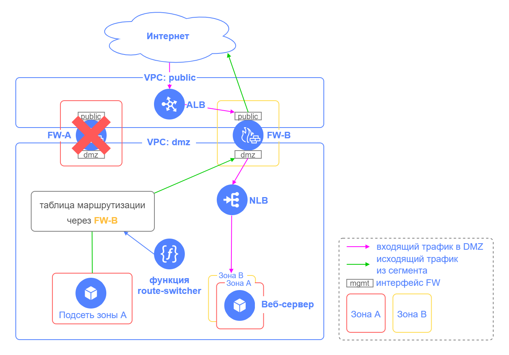

# Implementing a secure high-availability network infrastructure with a dedicated DMZ based on the Check Point NGFW

## Contents

* [About the solution](#описание-решения)
* [Architecture and key components](#архитектура-решения-и-основные-компоненты)
* [Segments and resources to deploy](#разворачиваемые-сегменты-и-ресурсы)
* [Preparing for deployment](#подготовка-к-развертыванию)
* [Deploying Terraform configuration](#развертывание-terraform-сценария)
* [Follow-up steps after deployment (includes a video tutorial)](#действия-после-развертывания-сценария-с-видео-демонстрацией)
* [Connecting to the management segment](#подключение-к-сегменту-управления)
* [Configuring NGFW](#настройка-ngfw)
* [Enabling the `route-switcher` module](#включение-работы-модуля-route-switcher)
* [Health check](#проверка-работоспособности)
* [Testing fault tolerance](#проверка-отказоустойчивости)
* [Requirements for production deployment](#требования-к-развертыванию-в-продуктивной-среде)
* [Deleting the created resources](#удаление-созданных-ресурсов)

## About the solution

This scenario is intended to deploy Yandex Cloud infrastructure with a view to:
* Protecting your infrastructure and segmenting it into security zones.
* Publishing your apps to the Internet from a [DMZ](https://en.wikipedia.org/wiki/DMZ_(computing)).
* Ensuring high availability of deployed apps.

Each network segment (hereinafter, simply _segment_) contains resources of a single purpose, isolated from other resources. For example, the DMZ segment is where public-facing services (usually, web server frontend) are placed, while the application segment hosts app backend. Each segment in a cloud has its own folder and a dedicated VPC cloud network. The segments communicate with each other through the Check Point next-generation firewall (NGFW), which is a VM that provides end-to-end protection and traffic control across the segments. 

Here are the key factors contributing to high availability of the architecture:
* Using two NGFWs.
* Distributing resources across two availability zones.
* Using [Application Load Balancer](#application-load-balancer-alb) to ensure application fault tolerance and load balancing in the DMZ.
* Using a [cloud function](#terraform-модуль-route-switcher) to re-route outgoing segment traffic when the NGFW fails.

Watch this Yandex Cloud webinar (note that it uses the previous version of `route-switcher`):

[Implementing a secure high-availability network infrastructure](https://www.youtube.com/live/brX-lIo6cLg?feature=share)

## Architecture and key components


Comments to the chart:

| Element name | Description | Purpose |
| ----------- | ----------- | ----------- | 
| VPC: public | Public segment | Arranging public access from the Internet | 
| VPC: mgmt | MGMT segment | Managing the cloud infrastructure and hosting internal resources | 
| VPC: dmz | DMZ segment | Hosting frontends of apps available from the Internet | 
| VPC: app | App segment | Hosting application backend | 
| VPC: database | Database segment | Hosting databases |
| FW-A | Check Point NGFW VM | Protecting the infrastructure and segmenting the network into security zones. Active for both incoming and outgoing traffic. |
| FW-B | Check Point NGFW VM | Protecting the infrastructure and segmenting the network into security zones. Active for incoming traffic and on standby for outgoing traffic. |
| ALB | FW-A and FW-B load balancers | Balancing load and maintaining fault tolerance for DMZ applications |
| `route-switcher` function | Cloud function | Switching the route table in the segment | 
| Jump VM | VM with configured [WireGuard VPN](https://www.wireguard.com/) | Establishing a secure VPN connection to the control segment |
| FW management server | VM running the Check Point Security Management software | Managing your Check Point NGFW solution from a single management center |
| NLB | Network load balancer for a web server group | Balancing the traffic load on web servers hosting the test application in the DMZ segment |
| App | VM running a NGINX web server | Sample test app deployed in the DMZ segment |

</details>

Here are the main components of the solution: 
* [Next-Generation Firewall](#next-generation-firewall)
* [Application Load Balancer](#application-load-balancer-alb)
* [Terraform `route-switcher` module](#terraform-модуль-route-switcher)
* [Security groups](#группы-безопасности)

FW-A and FW-B run in `Active/Active` mode for incoming traffic to the DMZ and in `Active/Standby` mode for outgoing traffic from the segments.


If FW-A fails, network connectivity (both to the Internet and between segments) will be provided through FW-B.



### Next-Generation Firewall

An NGFW is used for cloud network protection and segmentation with a dedicated DMZ for public-facing applications. [Yandex Cloud Marketplace](https://yandex.cloud/marketplace?categories=security) offers multiple options for NGFW.

This scenario uses [Check Point CloudGuard IaaS](https://yandex.cloud/marketplace/products/checkpoint/cloudguard-iaas-firewall-tp-payg-m). Its features include:
* Firewall, NAT, IPS, antivirus, and anti-bot protection services.
* Application-layer granular traffic management and session logging.
* Centralized security management with Check Point Security Management.

This example uses the basic access management and NAT policies for the Check Point solution.

Yandex Cloud Marketplace offers PAYG and BYOL licensing for Check Point CloudGuard IaaS. This example uses the BYOL option with a 15-day trial:
* Two NGFW VMs: [Check Point CloudGuard IaaS: Firewall & Threat Prevention BYOL](https://yandex.cloud/marketplace/products/checkpoint/cloudguard-iaas-firewall-tp-byol-m).
* Management server VM: [Check Point CloudGuard IaaS: Security Management BYOL](https://yandex.cloud/marketplace/products/checkpoint/cloudguard-iaas-security-management-byol-m).

We recommend the following options for production use:
* NGFW: [Check Point CloudGuard IaaS: Firewall & Threat Prevention PAYG](https://yandex.cloud/marketplace/products/checkpoint/cloudguard-iaas-firewall-tp-payg-m).
* You need a separate license for the `Check Point CloudGuard IaaS: Security Management` server. Alternatively, you can use your on-premise management server.

See below for the webinars on using Check Point solutions in Yandex Cloud:
* [Check Point in Yandex Cloud Marketplace](https://youtu.be/qvR9G_oDfnE).
* [CloudGuard IaaS Gateway in Yandex Cloud: Overview and installation](https://youtu.be/LtQltM71cUw).
* [Installing CloudGuard IaaS Security Management and Standalone in Yandex Cloud](https://youtu.be/MraLOJRDWts).

### Application Load Balancer (ALB)


[ALB](https://yandex.cloud/docs/application-load-balancer/concepts/) is used to balance traffic and maintain fault tolerance for DMZ applications by distributing user requests across the FW-A and FW-B public interfaces. As a result, FW-A and FW-B run in `Active/Active` mode for incoming traffic to the DMZ. This example features a group of Stream (TCP) backends with [session affinity](https://yandex.cloud/docs/application-load-balancer/concepts/backend-group#session-affinity) to the endpoint (FW) based on the user's IP address. By default, ALB evenly distributes traffic between FW-A and FW-B. You can configure [traffic localization](https://yandex.cloud/docs/application-load-balancer/concepts/backend-group#locality) to allow ALB to send requests to the FW in the same availability zone where the load balancer accepted the request. If no FW is running in that availability zone, the load balancer will send the request to another zone.

> **Important!**
>  
> You need to set up source NAT on FW-A and FW-B with the firewall IP address in the DMZ segment to ensure the app response returns through the same firewall that processed the user request. See [Configuring the NGFW](#настройка-ngfw) (step 11) for details.

Application Load Balancer offers advanced features, including the following:
* Support for HTTP/S, HTTP/S WebSocket, TCP/TLS, and HTTP/S gRPC. 
* Adaptive traffic distribution across application backends.
* Processing TLS traffic by setting up and terminating TLS sessions using Yandex Certificate Manager certificates.
* Support for session affinity and selecting load balancing modes.
* Options for creating and modifying responses to requests.
* Log analysis.

### Terraform `route-switcher` module

The Yandex Cloud network does not support VRRP/HSRP protocols across firewalls. 

The [`yc-route-switcher` solution](https://github.com/yandex-cloud-examples/yc-route-switcher/) is used to ensure fault tolerance for outgoing traffic from the segment. It performs the following:
* Switches next-hop addresses in route tables to FW-B when FW-A fails.
* Re-switches next-hop addresses in route tables back to FW-A after its recovery.

In this scenario, subnets use the FW-A route table for outgoing traffic from the segment.

The average response time to failure is one minute. You can reduce the interval between network VM health checks during the cloud function. To do this, configure `router_healthcheck_interval` in `route-switcher` [input parameters](https://github.com/yandex-cloud-examples/yc-route-switcher/?tab=readme-ov-file#входные-параметры-модуля). The default value is `60` (60 seconds). If you change it, you may additionally want to test the fault-tolerance use cases. We do not recommend to set the interval value to less than 10.


To run properly, `route-switcher` creates the following resources:
* Cloud function named `route-switcher`
* NLB 
* Bucket in Object Storage 

Comments to the chart:

| Element name | Description |
| ----------- | ----------- |
| Folder: `mgmt` | Folder to host `route-switcher` components |
| VPC: mgmt | The FW-A and FW-B network interfaces used to verify their availability reside in subnets of the MGMT segment. |
| FW-A, FW-B | Check Point NGFW VMs that require fault tolerance. |
| `route-switcher` function | Cloud function that checks FW-A and FW-B health. If FW-A is unavailable, the function switches the respective next-hop addresses in route tables to FW-B. The function also re-switches next-hop addresses in route tables back to FW-A after its recovery. | 
| NLB | Network load balancer for monitoring FW-A and FW-B availability. |
| Object Storage | Bucket in Object Storage to store the configuration file with the following information:<br>Route tables with preferred next-hop addresses for prefixes.<br>FW-A and FW-B IP addresses to check availability, as well as addresses for each network interface of a FW (the FW IP address and the respective IP address of its standby FW). |

### How the `route-switcher` function works

<details>
<summary>Expand to view the details</summary>

The `route-switcher` function is triggered once a minute (by default) to check the health (i.e., status) of each network VM. If a network VM is unavailable, this function switches the respective next-hop addresses in route tables. Once the network VM recovers, the function re-switches its next-hop addresses back in route tables (if configured so).

You can reduce the interval between checking network VM health during the cloud function. To do this, configure `router_healthcheck_interval` in the `route-switcher` input parameters. The default value is `60` (60 seconds). If you change it, you may additionally want to test the fault-tolerance use cases. We do not recommend to set the interval value to less than 10.


</details>

### Security groups

Security groups are intended to manage the traffic running across the resources in the same segment.

In this scenario, security groups allow incoming traffic on TCP ports 443 and 22, ICMP packets from sources within the group, and any outgoing traffic. Security groups in the MGMT, DMZ, and public segments also have additional permissions, such as those required for load balancers, NGFWs, and other deployed resources.

## Segments and resources to deploy

This solution creates resources for seven segments in the cloud. 

<details>
<summary>Expand to view the details</summary>

| Segment | Purpose | Resources | Folders and networks | Security groups | 
| ----------- | ----------- | ----------- | ----------- | ----------- |
| public | Handling public access from the Internet. | ALB | + | + |
| mgmt | Managing cloud infrastructure. | Two Check Point NGFWs, Check Point management server, jump VM running WireGuard to connect from the Internet, `route-switcher` cloud function, NLB to check NGFW availability, and a bucket to store configuration files for the `route-switcher` function. | + | + |
| dmz | Hosting frontends of apps available from the Internet. | NLB to balance load across web servers and a VM group with two NGINX servers used as an example. | + | + |
| app | Hosting backend applications. | | + | + |
| database | Hosting databases. | | + | + |
| vpc6 | For later use. | | + | + |
| vpc7 | For later use. | | + | + |

</details>

## Preparing for deployment

1. Before starting the deployment, [sign up for Yandex Cloud and create a billing account](https://yandex.cloud/docs/tutorials/infrastructure-management/terraform-quickstart#before-you-begin).

1. [Install Terraform](https://yandex.cloud/docs/tutorials/infrastructure-management/terraform-quickstart#install-terraform).

1. Check whether there is an account in the cloud with the `admin` permissions for the cloud.

1. [Install and configure the Yandex Cloud CLI](https://yandex.cloud/docs/cli/quickstart).

1. [Install Git](https://github.com/git-guides/install-git).

1. Check whether your cloud quotas allow you to deploy your resources for this scenario:

    <details>
    <summary>Expand to see the amount of resources created for this scenario</summary>

    | Resource | Amount |
    | ----------- | ----------- |
    | Folders | 7 |
    | Instance groups | 1 |
    | Virtual machines | 6 |
    | VM vCPUs | 18 |
    | VM RAM | 30 GB |
    | Disks | 6 |
    | SSD size | 360 GB |
    | HDD size | 30 GB |
    | Cloud networks | 7 |
    | Subnets | 14 |
    | Route tables | 4 |
    | Security groups | 10 |
    | Static public IP addresses | 2 |
    | Public IP addresses | 2 |
    | Static routes | 17 |
    | Buckets | 1 |
    | Cloud functions | 1 |
    | Triggers for cloud functions | 1 |
    | Total RAM for all running functions | 128 MB |
    | Network load balancers (NLBs) | 2 |
    | NLB target groups | 2 |
    | Application load balancers (ALBs) | 1 |
    | ALB backend groups | 1 |
    | ALB target groups | 1 |

    </details>

## Deploying Terraform configuration

1. Clone the `yandex-cloud-examples/yc-dmz-with-high-available-ngfw` GitHub repository and go to the `yc-dmz-with-high-available-ngfw` folder:
    ```bash
    git clone https://github.com/yandex-cloud-examples/yc-dmz-with-high-available-ngfw.git
    cd yc-dmz-with-high-available-ngfw
    ```

1. Set up the deployment environment (see the details [here](https://yandex.cloud/docs/tutorials/infrastructure-management/terraform-quickstart#get-credentials)):
    ```bash
    export YC_TOKEN=$(yc iam create-token)
    ```

1. Put your custom values for variables in the `terraform.tfvars` file. It contains sample values, but you can replace them with your own data (cloud ID, VPC name, subnets, DMZ app port, and the jump VM connection properties). Make sure to specify your cloud ID (`cloud_id`) and the list of public IPs and subnets (`trusted_ip_for_access_jump-vm`) trusted to access the jump VM. 

    <details>
    <summary>Expand to view the variables in `terraform.tfvars`</summary>

    | Name | Description | Sample value |
    | ----------- | ----------- | ----------- |
    | cloud_id | ID of your cloud in Yandex Cloud. | b1g8dn6s3v2eiid9dbci |
    | public_app_port | TCP port for a DMZ application the ALB will use to accept incoming user traffic. | "80" |
    | internal_app_port | Internal TCP port of a DMZ application to which the ALB will direct traffic. You can specify the same port as `public_app_port` or a different one. | "8080" |
    | trusted_ip_for_access_jump-vm | List of public IPs or subnets trusted to access the jump VM. Used in the incoming rule of the jump VM security group.  | ["A.A.A.A/32", "B.B.B.0/24"] |
    | wg_port | UDP port for inbound traffic as per the jump VM WireGuard settings. | "51820" |
    | wg_client_dns | List of DNS server addresses in the management cloud network that the admin workstation will use after establishing the WireGuard tunnel to the jump VM. | "192.168.1.2, 192.168.2.2" |
    | jump_vm_admin_username | Username for connecting to the jump VM. | "admin" |
    | **Segment 1** |
    | vpc_name_1 | Name of the VPC and folder for segment 1 | "demo-dmz" |
    | subnet-a_vpc_1 | Subnet in zone A for segment 1 | "10.160.1.0/24" | 
    | subnet-b_vpc_1 | Subnet in zone B for segment 1 | "10.160.2.0/24" | 
    | **Segment 2** |||
    | vpc_name_2 | Name of the VPC and folder for segment 2 | "demo-app" |
    | subnet-a_vpc_2 | Subnet in zone A for segment 2 | "10.161.1.0/24" | 
    | subnet-b_vpc_2 | Subnet in zone B for segment 2 | "10.161.2.0/24" | 
    | **Segment 3** |||
    | vpc_name_3 | Name of the VPC and folder for segment 3 | "demo-public" |
    | subnet-a_vpc_3 | Subnet in zone A for segment 3 | "172.16.1.0/24" | 
    | subnet-b_vpc_3 | Subnet in zone B for segment 3 | "172.16.2.0/24" | 
    | **Segment 4** |||
    | vpc_name_4 | Name of the VPC and folder for segment 4 | "demo-mgmt" |
    | subnet-a_vpc_4 | Subnet in zone A for segment 4 | "192.168.1.0/24" | 
    | subnet-b_vpc_4 | Subnet in zone B for segment 4 | "192.168.2.0/24" | 
    | **Segment 5** |||
    | vpc_name_5 | Name of the VPC and folder for segment 5 | "demo-database" |
    | subnet-a_vpc_5 | Subnet in zone A for segment 5 | "10.162.1.0/24" | 
    | subnet-b_vpc_5 | Subnet in zone B for segment 5 | "10.162.2.0/24" | 
    | **Segment 6** |||
    | vpc_name_6 | Name of the VPC and folder for segment 6 | "demo-vpc6" |
    | subnet-a_vpc_6 | Subnet in zone A for segment 6 | "10.163.1.0/24" | 
    | subnet-b_vpc_6 | Subnet in zone B for segment 6 | "10.163.2.0/24" | 
    | **Segment 7** |||
    | vpc_name_7 | Name of the VPC and folder for segment 7 | "demo-vpc7" |
    | subnet-a_vpc_7 | Subnet in zone A for segment 7 | "10.164.1.0/24" | 
    | subnet-b_vpc_7 | Subnet in zone B for segment 7 | "10.164.2.0/24" | 

    </details>

1. Initialize Terraform:
    ```bash
    terraform init
    ```

1. Check that your Terraform files are properly configured:

    ```bash
    terraform validate
    ```

1. Check the list of cloud resources you are about to create:

    ```bash
    terraform plan
    ```

1. Create resources. It will take you around seven minutes to deploy all resources in the cloud:

    ```bash
    terraform apply
    ```

1. After `terraform apply` is over, the command line will output a list of information on the deployed resources. Later on, you can view this information by running the `terraform output` command:

    <details>
    <summary>Expand to view the information on deployed resources</summary>

    | Name | Description | Sample value |
    | ----------- | ----------- | ----------- |
    | dmz-web-server-nlb_ip_address | IP address of the load balancer in the DMZ segment, routing traffic to the target group with web servers used to test an app published in the DMZ. Used for configuring destination NAT on a firewall. | "10.160.1.100" |
    | fw-a_ip_address | FW-A IP address in the management network. | "192.168.1.10" |
    | fw-alb_public_ip_address | ALB public IP address. It is used to access the application published in the DMZ from the Internet. | "C.C.C.C" |
    | fw-b_ip_address | FW-B IP address in the management network. | "192.168.2.10" |
    | fw_gaia_portal_mgmt-server_password | Default password for the initial connection to the firewall management server IP address over HTTPS. | "admin" |
    | fw_mgmt-server_ip_address | FW management server IP address in the management network. | "192.168.1.100" |
    | fw_sic-password | One-time password (SIC) for adding a firewall to the firewall management server. | The `terraform output` command does not return this variable. To view its value, run `terraform output fw_sic-password`. |
    | fw_smartconsole_mgmt-server_password | Password for connecting to the firewall management server through the Check Point SmartConsole GUI. | The `terraform output` command does not return this variable. To view its value, run `terraform output fw_smartconsole_mgmt-server_password`. |
    | jump-vm_path_for_WireGuard_client_config | Configuration file for enabling a secure WireGuard VPN connection to the jump VM. | "./jump-vm-wg.conf" |
    | jump-vm_public_ip_address_jump-vm | Jump VM public IP address. | "D.D.D.D" |
    | path_for_private_ssh_key | File with a private key to connect to VMs over SSH (jump VM, FW-A, FW-B, MGMT server, and DMZ web servers). | "./pt_key.pem" |
    | route-switcher_nlb | Name of the network load balancer for monitoring availability of FW-A and FW-B, in the `mgmt` folder. | "route-switcher-hnaf1gr0sx" |
    | route-switcher_bucket | Name of the Object Storage bucket, in the `mgmt` folder, to store the configuration file with the following information:<br>Route tables with preferred next-hop addresses for prefixes.<br>FW-A and FW-B IP addresses to check availability, as well as addresses for each FW (the FW IP address and the respective IP address of its standby FW). | "route-switcher-hnaf1gr0sx" |
    | route-switcher_function | Name of the cloud function in the `mgmt` folder that enables `route-switcher` to ensure fault tolerance for outgoing traffic from segments. | "route-switcher-lb-hnaf1gr0sx" |

    </details>

## Follow-up steps after deployment (includes a video tutorial)

After successfully deploying Terraform configuration, follow these steps:
1. Review the [requirements for production deployment](#требования-к-развертыванию-в-продуктивной-среде).
1. [Connect to the management segment](#подключение-к-сегменту-управления) using the jump VM for configuring the Check Point NGFW and SSH access to cloud resources.
1. [Configure the NGFW](#настройка-ngfw) to meet your infrastructure needs or use the steps we provide as a reference. 
1. [Enable](#включение-работы-модуля-route-switcher) `route-switcher`.
1. Run a basic [health check](#проверка-работоспособности) of the solution. 
1. Run a basic [fault tolerance test](#проверка-отказоустойчивости) of the solution. 

> **Important!**
> 
> Unless you configure your NGFW step by step and enable `route-switcher`, you will not be able to check the health and fault tolerance of your solution.

Watch [this tutorial](https://storage.yandexcloud.net/cloud-www-assets/architects-video/architect-solutions-library.mp4) that covers the following:
* Overview of the primary solution elements in the Yandex Cloud console after deploying Terraform.
* Connecting to the management segment and initial NGFW configuration.
* Example of basic access management and NAT policies for an NGFW. 
* Verifying the efficiency of access management policies for an NGFW.
* Testing fault tolerance.

## Connecting to the management segment

Once the deployment is complete, the MGMT segment of the management network will contain a jump VM based on an Ubuntu image with the [WireGuard VPN](https://www.wireguard.com/) configured for a secure connection. Once you set up a VPN tunnel to the jump VM, the admin workstation will show routes through the VPN tunnel to the MGMT, DMZ, app, and database subnets. You can also connect to the jump VM over SSH using the SSH key and username from `terraform output` and username from the `jump_vm_admin_username` variable.

1. Install [WireGuard](https://www.wireguard.com/install/) for your specific operating system on the admin workstation.

1. Once the resources are created, the Terraform configuration folder will contain `jump-vm-wg.conf`, a WireGuard client configuration file for connecting to the jump VM. Add a new tunnel in WireGuard running Windows or macOS. To do this, click **Import tunnel(s) from file** and select `jump-vm-wg.conf`. Click **Activate** to activate the tunnel.  

1. Check network connectivity with the FW management server via the WireGuard VPN tunnel using `ping 192.168.1.100` in the command line. 

For an example of connecting to the management segment, watch [this tutorial](https://storage.yandexcloud.net/cloud-www-assets/architects-video/architect-solutions-library.mp4).

## Configuring the NGFW

You can configure the deployed FW-A and FW-B to meet your specific needs in line with your company security policy. To manage and set up Check Point, use the SmartConsole GUI client for Windows. 

This example describes how to configure firewalls (FW-A and FW-B) with basic access management and NAT policies required for health checks and fault tolerance testing. This is within the scope of this scenario but insufficient for production deployment.

This scenario tells you how to configure your NGFW through the following steps in SmartConsole:
* Adding FW-A and FW-B.
* Configuring the FW-A and FW-B network interfaces.
* Creating network objects. 
* Configuring the access management policy.
* Configuring the NAT policy.

For an example of configuring an NGFW, watch [this tutorial](https://storage.yandexcloud.net/cloud-www-assets/architects-video/architect-solutions-library.mp4).

1. Connect to the firewall management server at https://192.168.1.100. Use the default admin credentials: `admin` for both username and password. This will open the Gaia Portal. Once connected, change password by selecting`User Management > Change My Password`.

1. On the Gaia Portal home page, download the SmartConsole GUI client by clicking the following link at the top: `Manage Software Blades using SmartConsole. Download Now!`. SmartConsole is only compatible with Windows. Install SmartConsole on the admin workstation.

1. Start SmartConsole and establish a connection using `admin` as the username, `192.168.1.100` as the management server IP address, and password from the `terraform output fw_smartconsole_mgmt-server_password` output.

1. Add FW-A and FW-B to the management server using the **New Gateway** option in the Wizard:
    - Firewall name: FW-a and FW-b.
    - Gateway type: CloudGuard IaaS. 
    - Gateway IP: FW IP address in the MGMT segment (`192.168.1.10` for FW-A and `192.168.2.10` for FW-B).
    - Initiated trusted communication now: One-time SIC password from the `terraform output fw_sic-password` output.

1. Configure gateway network interfaces for each firewall (`Network Management > Topology Settings`):
    - Rename the default network groups based on static routes in the FW. For example, rename `FW-a_eth0` to `mgmt`.
    - Specify the security zone.
    - Navigate to **Prevent and Log** to make sure anti-spoofing is enabled.
    - For the DMZ networks (Net_10.160.1.0 and Net_10.160.2.0), set up **Automatic Hide NAT** to enable source NAT on the FW public interface for DMZ-initiated traffic to the Internet. 

    <details>
    <summary>Configuring FW-A interfaces</summary>

    | Interface | IPv4 address/mask | Leads To | Security Zone | Anti Spoofing |
    | ----------- | ----------- | ----------- | ----------- | ----------- |
    | eth0 | 192.168.1.10/24 | FW-a_eth0 -> mgmt (Internal) | InternalZone | Prevent and Log |
    | eth1 | 172.16.1.10/24 | Internet (External) | ExternalZone | Prevent and Log |
    | eth2 | 10.160.1.10/24 | FW-a_eth2 -> dmz, DMZ (Internal) | DMZZone | Prevent and Log |
    | eth3 | 10.161.1.10/24 | FW-a_eth3 -> app (Internal) | InternalZone | Prevent and Log |
    | eth4 | 10.162.1.10/24 | FW-a_eth4 -> database (Internal) | InternalZone | Prevent and Log |
    | eth5 | 10.163.1.10/24 | This Network (Internal) | InternalZone | Prevent and Log |
    | eth6 | 10.164.1.10/24 | This Network (Internal) | InternalZone | Prevent and Log |

        

    <details>
    <summary>Configuring FW-A _mgmt_ interface</summary>

    

    </details>
    
    <details>
    <summary>Configuring FW-A _public_ interface</summary>

    

    </details>

    <details>
    <summary>Configuring FW-A _dmz_ interface</summary>

    

    </details>

    <details>
    <summary>Setting up the NAT configuration for a DMZ subnet in zone A</summary>

    

    </details>

    <details>
    <summary>Setting up the NAT configuration for a DMZ subnet in zone B</summary>

    

    </details>

    <details>
    <summary>Configuring FW-A _app_ interface</summary>

    

    </details>

    <details>
    <summary>Configuring FW-A _database_ interface</summary>

    

    </details>

    </details>

    <details>
    <summary>Configuring FW-B interfaces</summary>

    | Interface | IPv4 address/mask | Leads To | Security Zone | Anti Spoofing |
    | ----------- | ----------- | ----------- | ----------- | ----------- |
    | eth0 | 192.168.2.10/24 | FW-b_eth0 -> mgmt (Internal) | InternalZone | Prevent and Log |
    | eth1 | 172.16.2.10/24 | Internet (External) | ExternalZone | Prevent and Log |
    | eth2 | 10.160.2.10/24 | FW-b_eth2 -> dmz, DMZ (Internal) | DMZZone | Prevent and Log |
    | eth3 | 10.161.2.10/24 | FW-b_eth3 -> app (Internal) | InternalZone | Prevent and Log |
    | eth4 | 10.162.2.10/24 | FW-b_eth4 -> database (Internal) | InternalZone | Prevent and Log |
    | eth5 | 10.163.2.10/24 | This Network (Internal) | InternalZone | Prevent and Log |
    | eth6 | 10.164.2.10/24 | This Network (Internal) | InternalZone | Prevent and Log |

    

    To configure interfaces for FW-B, follow the same steps as for FW-A (see the interface screenshots for FW-A). However, unlike FW-A, there is no need to rename the network groups; instead, simply find and select the appropriate group from the list.

    <details>
    <summary>Sample configuration of FW-A _mgmt_ interface</summary>
    
    

    </details>

    </details>

1. Create networks (`Objects -> Object Explorer > New... -> Network...`):

    | Object name | Network address | Net mask |
    | ----------- | ----------- | ----------- |
    | public - a | 172.16.1.0 | 255.255.255.0 |
    | public - b | 172.16.2.0 | 255.255.255.0 |

    <details>
    <summary>Sample screenshot for _public - a_</summary>

    

    </details>

1. Create a network group (`Objects -> Object Explorer > New... -> Network Group...`):

    | Name | Network objects |
    | ----------- | ----------- |
    | public | public - a, public - b |

    <details>
    <summary>Network group screenshot</summary>

    

    </details>

1. Create hosts (`Objects -> Object Explorer > New... -> Host...`):

    | Object name | IPv4 address |
    | ----------- | ----------- |
    | dmz-web-server | 10.160.1.100 |
    | FW-a-dmz-IP | 10.160.1.10 |
    | FW-a-public-IP | 172.16.1.10 |
    | FW-b-dmz-IP | 10.160.2.10 |
    | FW-b-public-IP | 172.16.2.10 |

    <details>
    <summary>Sample screenshot for _dmz-web-server_</summary>

    

    </details>

1. Create a TCP service for the deployed app in the DMZ segment (`Objects -> Object Explorer > New... -> Service -> TCP...`): 

    | Name | Port |
    | ----------- | ----------- |
    | TCP_8080 | 8080 |

    <details>
    <summary>TCP Service screenshot</summary>

    

    </details>

1. Add rules to the access management policy (`SECURITY POLICIES -> Access Control - Policy`). See below for an example of basic rules to test the firewall policies, run NLB health checks, publish a test application from the DMZ segment, and test its fault tolerance.

    | No | Name | Source | Destination | VPN | Services & Applications | Action | Track | Install On |
    | ----------- | ----------- | ----------- | ----------- | ----------- | ----------- | ----------- | ----------- | ----------- |
    | 1 | Web-server port forwarding on FW-a | public | FW-a-public-IP | Any | TCP_8080 | Accept | Log | FW-a |
    | 2 | Web-server port forwarding on FW-b | public | FW-b-public-IP | Any | TCP_8080 | Accept | Log | FW-b |
    | 3 | FW management & NLB healthcheck | mgmt | FW-a, FW-b, mgmt-server | Any | https, ssh | Accept | Log | Policy Targets (All gateways)  |
    | 4 | Stealth | Any | FW-a, FW-b, mgmt-server | Any | Any | Drop | Log | Policy Targets (All gateways) |
    | 5 | mgmt to DMZ | mgmt | dmz | Any | Any | Accept | Log | Policy Targets (All gateways) |
    | 6 | mgmt to app | mgmt | app | Any | Any | Accept | Log | Policy Targets (All gateways) |
    | 7 | mgmt to database | mgmt | database | Any | Any | Accept | Log | Policy Targets (All gateways) |
    | 8 | ping from dmz to internet | dmz | ExternalZone | Any | icmp-reguests (Group) | Accept | Log | Policy Targets (All gateways) |
    | 9 | Cleanup rule | Any | Any | Any | Any | Drop | Log | Policy Targets (All gateways) |

    <details>
    <summary>Description the access management policy rules</summary>

    | Number | Name | Description |
    | ----------- | ----------- | ----------- |
    | 1 | Web-server port forwarding on FW-a | Allows TCP traffic on port 8080 from the public segment to the DMZ application for FW-A. | 
    | 2 | Web-server port forwarding on FW-b | Allows TCP traffic on port 8080 from the public segment to the DMZ application for FW-B. | 
    | 3 | FW management & NLB healthcheck | Allows access to FW-A, FW-B, and the firewall management server from the MGMT segment for management tasks, as well as access to FW-A and FW-B for state verification using the NLB health check. |
    | 4 | Stealth | Denies access to FW-A, FW-B, and the firewall management server from other segments. |
    | 5 | mgmt to DMZ | Allows access from the MGMT segment to DMZ for management tasks. |
    | 6 | mgmt to app | Allows access from the MGMT to the app segment for management tasks. |
    | 7 | mgmt to database | Allows access from the MGMT to the database segment for management tasks. |
    | 8 | ping from dmz to internet | Allows outbound ICMP packets from the DMZ segment to the Internet for performance and fault tolerance testing. |
    | 9 | Cleanup rule | Denies access to other traffic. |

    </details>

    <details>
    <summary>Access management policy screenshot</summary>

    

    </details>

1. Set up static NAT (`SECURITY POLICIES -> Access Control - NAT`). Source NAT ensures that an application response returns through the same firewall that processed the user request. Destination NAT routes user requests to the network traffic load balancer, behind which the application's web server group is installed.

    Headers of packets received from the ALB with user requests to the application published in the DMZ will be translated to the source IPs of the firewall DMZ interfaces and the destination IPs of the web server load balancer.

    | No | Original Source | Original Destination | Original Services | Translated Source | Translated Destination | Translated Services | Install On |
    | ----------- | ----------- | ----------- | ----------- | ----------- | ----------- | ----------- | ----------- |
    | 1 | public | FW-a-public-IP | TCP_8080 | FW-a-dmz-IP (apply Hide NAT) | dmz-web-server | Original | FW-a |
    | 2 | public | FW-b-public-IP | TCP_8080 | FW-b-dmz-IP (apply Hide NAT) | dmz-web-server | Original | FW-b |

    <details>
    <summary>NAT policy screenshots</summary>

    

    

    </details>    

1. **Make sure to apply the settings and policies to both firewalls using the install policy to ensure they take effect.**
    
    <details>
    <summary>Install policy screenshot</summary>

    

    </details> 

## Enabling `route-switcher`

After you complete the NGFW setup, make sure that FW-A and FW-B health checks return `Healthy`. To do this, in the Yandex Cloud console, the `mgmt` folder, select `Network Load Balancer` and go to the `route-switcher-lb-...` network load balancer page. Expand the target group and make sure the targets are `Healthy`. If they are `Unhealthy`, check that FW-A and FW-B are up and running and [configured](#настройка-ngfw).

After you verified that checking the health of FW-A and FW-B returns `Healthy`, switch the `start_module` input parameter to `true` in `route-switcher.tf` to enable `route-switcher`, and run these commands:

```bash
terraform plan
terraform apply
```

After running `terraform apply`, you will get the `route-switcher-trigger-...` trigger in the `mgmt` folder. This trigger will start the `route-switcher` cloud function every minute. The trigger is initiated within five minutes after it is created.

After the trigger fires, `route-switcher` gets enabled to ensure fault tolerance of outgoing traffic across the segments.

## Health check

1. In your browser, open `http://<ALB_public_IP_address>` (you can find this IP address in the `terraform output fw-alb_public_ip_address` output). This will bring you to the `Welcome to nginx!` page.

1. Go to the Terraform configuration folder on the workstation where you deployed Terraform and connect to a VM in the DMZ segment over SSH (replace the VM IP address as needed):
    ```bash
    ssh -i pt_key.pem admin@10.160.2.22
    ```

1. Run `ping` to an Internet resource. This ping should be successful as allowed by the `1. ping from dmz to internet` access management rule configured on the firewall:   
    ```bash
    ping ya.ru
    ```
    <details>
    <summary>Firewall log for the allow rule</summary>

    

    </details> 

1. Run `ping` to reach the jump VM in the MGMT segment. The ping will fail as denied by the `1. Cleanup rule` access management rule configured on the firewall:
    ```bash
    ping 192.168.1.101
    ```

    <details>
    <summary>Firewall log for the deny rule</summary>

    

    </details>

## Testing fault tolerance

1. On the workstation where you deployed Terraform configuration, install `httping` to send recurring HTTP requests to the test app. For a Windows workstation, install [this version](https://github.com/pjperez/httping). To [install it on Linux](https://github.com/folkertvanheusden/HTTPing), run this command:

    ```bash
    sudo apt-get install httping
    ```

1. Enable incoming traffic to the application published in the DMZ segment by running `httping` with the ALB public IP address (you can retrieve it from the `terraform output fw-alb_public_ip_address` output):

    ```bash
    httping http://<public_IP_address_of_ALB>
    ```

1. Connect to a VM in the DMZ segment over SSH (replace the VM IP address as needed):

    ```bash
    ssh -i pt_key.pem admin@10.160.2.22
    ```

1. Set a password for the `admin` user:

    ```bash
    sudo passwd admin
    ```

1. In the Yandex Cloud console, change the settings for that VM by adding `Grant access to serial console`. Connect to the VM serial console, enter the `admin` username and the password from step 4. 

1. Enable outgoing traffic from the DMZ segment by running `ping` to an Internet resource:

    ```bash
    ping ya.ru
    ```

1. In the Yandex Cloud console, in the `mgmt` folder, stop the `fw-a` VM by emulating the main firewall failure.

1. Monitor the loss of `httping` and `ping` packets. After FW-A fails, there may be a traffic loss for around one minute, and then the traffic should recover.

1. In the `dmz` folder, check that the `dmz-rt` route table now uses the FW-B address as its next hop.

1. In the Yandex Cloud console, start the `fw-a` VM to emulate the main firewall recovery. 

1. Monitor the loss of `httping` and `ping` packets. After FW-A recovers, there may be a traffic loss for around one minute, and then the traffic should recover.

1. In the `dmz` folder, check that the `dmz-rt` route table now uses the FW-A address as its next hop.

## Requirements for production deployment

* Make sure to change the passwords provided in the `check-init...yaml` files via the metadata service:
    - SIC password for connecting the firewall and the firewall management server.
    - Check Point SmartConsole password.
    - Admin user password for the firewall management server. You can change this password in the Gaia Portal.
* Save the `pt_key.pem` private SSH key to a secure location or recreate it separately from Terraform.
* Delete the jump VM if you no longer need it.
* If you plan to use the jump VM to connect to the management segment with WireGuard VPN, change the WireGuard keys on the jump VM and admin workstation. 
* Configure the Check Point NGFW to meet your specific needs in line with your company security policy.
* Do not assign public IP addresses to the VMs in those segments where the Check Point NGFW route tables are used (learn more [here](https://yandex.cloud/docs/vpc/concepts/routing#restrictions)). The only exception is the `mgmt` segment where routing tables do not use the `0.0.0.0/0` default route. 
* Select your preferred Check Point CloudGuard IaaS license and image (see [Next-generation firewall](#next-generation-firewall)).

## Deleting the created resources

To delete resources created using Terraform, run `terraform destroy`.

> **Warning**
> 
> Terraform will **permanently** delete all the resources you created while deploying this solution, such as networks, subnets, VMs, load balancers, folders, etc.

Since the resources you created reside in folders, a faster way to delete them all is to delete all folders using the YandexCloud console and then, the `terraform.tfstate` file from the folder on your PC.
